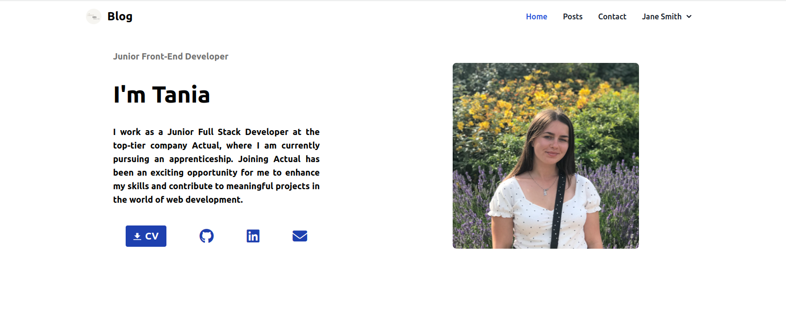

# Test technique - Meeting Hub

## Prerequisites
#### You need to have installed on your machine:

- Composer : https://getcomposer.org/
- Docker : https://www.docker.com/

## Usage
1. Clone the repository: 
```
git clone git@github.com:tania0808/personal_blog.git
```

2. Configure your environment variables (clone the .env.example file)
```
DB_DSN = pgsql:host=172.17.0.1;port=5432;dbname=postgres
DB_USER = postgres
DB_PASSWORD = postgres

GMAIL_HOST = 
GMAIL_PORT = 
GMAIL_USER = 
GMAIL_PASSWORD = 
```

3. Run the application:
```
make install
```
4. Go to this url:
```
http://localhost:8180/
```

# Professional Blog Project

## Overview
Congratulations on embarking on the journey of web development with PHP! This project empowers you to showcase your skills through the creation of a professional blog. As a PHP developer, this blog will serve as a platform to exhibit your talents and make a compelling impression on potential employers or clients.

## Project Structure
The project involves developing a professional blog website with two main groups of pages:

- **Pages for All Visitors**
    - Home Page
    - Blog Posts List Page
    - Blog Post Detail Page
    - Edit Blog Post Page
    - Footer Menu

- **Administration Pages**
    - Accessible only to registered and validated users.
    - Ensure the security of the administration section.

## Development Constraints
- Development without WordPress, building everything from scratch.
- Integrate external libraries via Composer if needed.
- Mobile responsiveness is mandatory.
- Consider using Twig for templating (recommended but not obligatory).
- Secure the administration section, granting access only to users with "administrator" rights.
- Eliminate security vulnerabilities (XSS, CSRF, SQL Injection, session hijacking, PHP script uploads).
- Host the project on GitHub, collaborating through pull requests and committing in English.
- Create and manage issues (tickets) on GitHub, written in English, covering project tasks.
- Follow SymfonyInsight or Codacy for code quality, aiming for a minimum silver medal on SymfonyInsight.
- Adhere to PSR standards for clean, understandable, and maintainable code.

### Screenshot



### Built with
- PHP8.2
- PostgresSQL
- Tailwind CSS


## Author

- Website - [Tetiana His](https://portfolio-tania-his.netlify.app/)
- Linkedin - [Tetiana His](https://www.linkedin.com/in/tetiana-his/)
- Github - [@tania0808](https://github.com/tania0808/)
